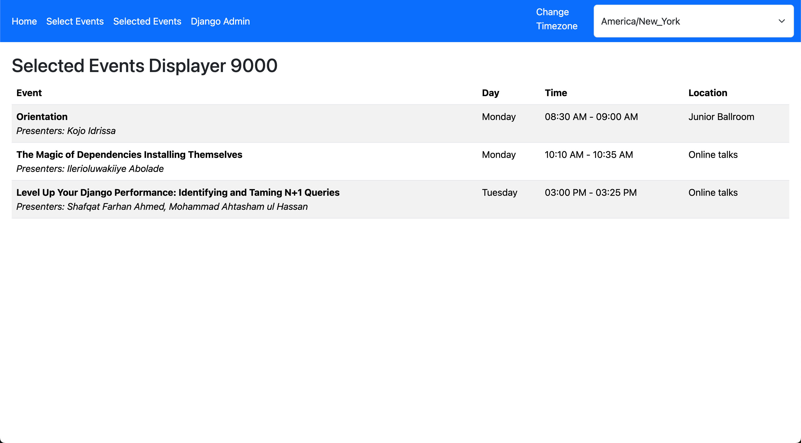

# schedule_maker_9000

<!-- TOC -->
* [schedule_maker_9000](#schedule_maker_9000)
  * [Setup](#setup)
  * [Notes](#notes)
  * [Preview](#preview)
<!-- TOC -->

An app idea for DjangoCon 2024. I'd like to be able to pick my talks and have the app generate a schedule for me.
Initially I used BeautifulSoup and the PyCon schedule to build out a proof of concept. Then I realized
https://github.com/djangocon/2024.djangocon.us/ exists.

Plenty of things are broken or incomplete. I didn't have as much to work on this as I thought.

Having said all that, it kinda works now. I'd like to use this repo to build a better app over time.

TODO:
- ~~Add presenter info~~
- Markdown rendering
- Better styling
- Better error handling
- Grab the schedule automatically from the DjangoCon repo
- Unselect events from the selected events page
- Break down selected events by day
- Clean up unused models
- Organize views and templates better

## Setup

- Create `.env` from example file.
- Add these folders to the root directory:
    - https://github.com/djangocon/2024.djangocon.us/tree/main/src/_content/schedule/talks
    - https://github.com/djangocon/2024.djangocon.us/tree/main/src/_content/presenters
- Run `docker compose up`
- View at http://localhost:9000/

## Notes

Helper snippet to generate passwords:

`openssl rand -base64 128 | tr -d '/$\n' | head -c 64; echo`

## Preview

Select Events:

Selected Events:

